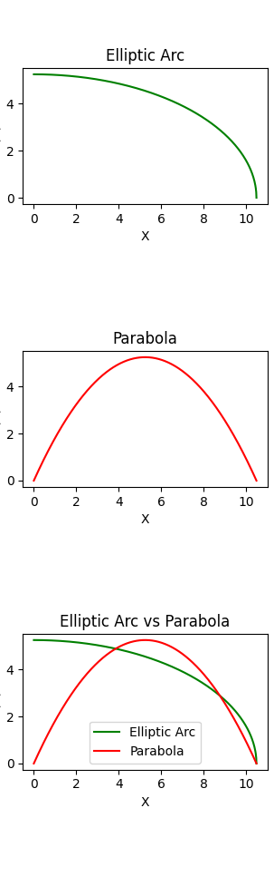

# Plotting-Parabola-and-Elliptical-Arc

## Table of Contents
1. [Introduction](#introduction)
2. [Features](#features)
3. [Technologies Used](#technologies-used)
4. [How to Run](#how-to-run)
5. [Sample Output](#sample-output)
6. [Analysis](#analysis)
7. [Significance](#significance)
8. [Author](#author)
9. [License](#license)

## Introduction
This Python program computes and plots the coordinates for a parabola and an elliptical arc. The program uses NumPy for mathematical calculations and Matplotlib for plotting the graphs.

## Features
- User input validation for number of intervals and maximum coordinates along the X and Y axes.
- Computes X and Y coordinates for a parabola and an elliptical arc.
- Plots each curve individually as well as overlays them on a single plot.
- Shows all plots collectively as subplots in one figure.

## Technologies Used
- Python
- NumPy for numerical calculations
- Matplotlib for plotting graphs
- Built-in `time` library for displaying the time of execution

## How to Run
1. Clone the repository.
2. Run `main.py`.
3. Follow the on-screen prompts to input the number of intervals and maximum coordinates along the X and Y axes.

## Sample Output

## Analysis
1. **User Input Validation**: The program validates all user inputs to ensure they are greater than zero.

2. **Data Computation**: The program computes the coordinates for both a parabola and an elliptical arc based on user inputs.

3. **Graphical Presentation**: The program plots these coordinates in multiple ways to provide a comparative and individual view.

## Significance
1. **Graphical Analysis**: The project serves as an excellent introduction to plotting mathematical functions and understanding their properties.

2. **Educational Value**: It can be used as an educational tool to better understand parabolas and elliptical arcs.

3. **Customization**: The program allows for user-defined inputs for the curves, offering flexibility for specific needs.

## Author
**Farjad Tariq**

## License
This project is licensed under the MIT License - see the [LICENSE.md](LICENSE) file for details.
